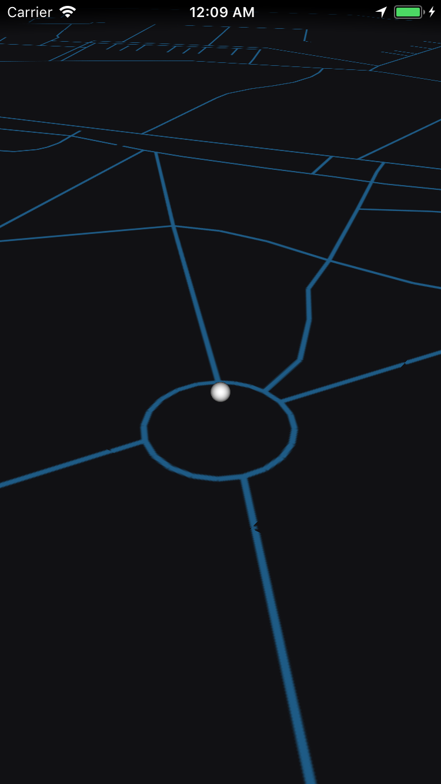
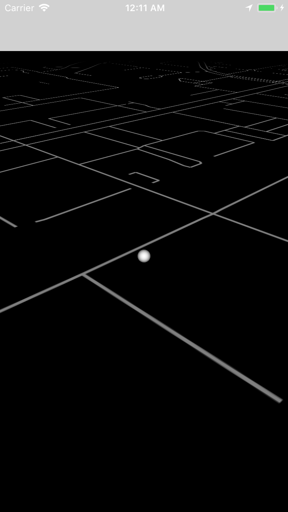
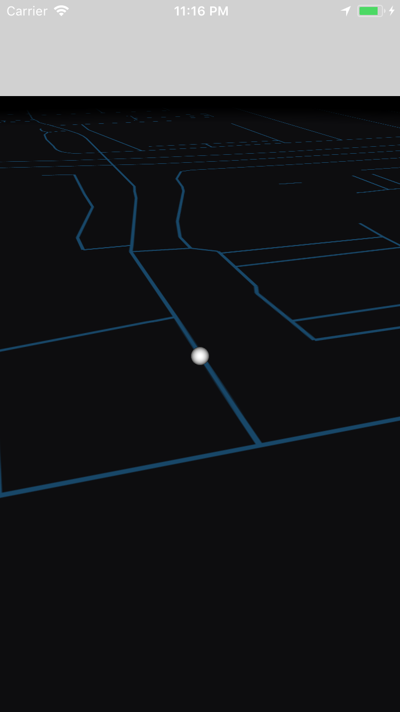

# 3D iOS Map SceneKit Rendering App - Mapzen data

A SceneKit based Map rendering from scratch using MapBox data at zoom level 16

A lot of effort has gone into UX, making the camera rotation with touch to work in an acceptable way (cannot go underground, cannot pass a certain height, can rotate 360 around the player etc)

Mapzen API has been killed, and to transition to mapbox as this repository has:
https://github.com/nenuadrian/swift-2D-tile-real-world-map-gps-game

Post processing just like in there needs to be done and a bit of the code changes. But what that repo does in PHP, this one can do in Swift

# Setup

Make sure to set DEBUG to false in constants or you'll be stuck to one location
SHould work out of the box once the mapbox issue is resolved

# Guides

web-maps-cartography-guide.pdf guide attached, describing how maps generally work on the web and in apps

In case you don't already have a basic understanding of how GPS maps are tiled.

# Known issues

Very likely if you travel enough you'll hit rounding errors because of the coordinates. When you surpass a certain number of tile, the system should reset and select a new origin tile, by updating the so called primordialTile to be a new one the player is currently one, and redrawing everything relative to that, avoiding the rounding error.

There're are surely issues if you go around the globe (eg before first or after last tile in a row)

# Screenshots

