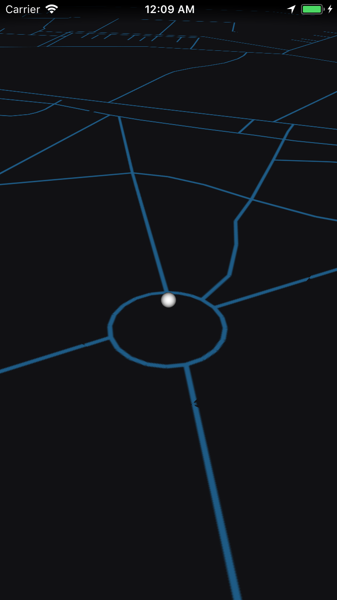
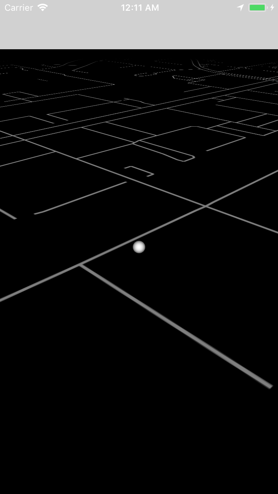
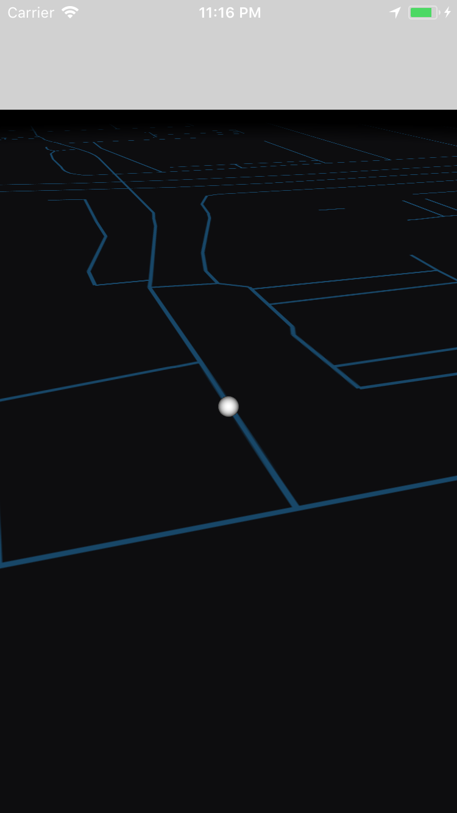

# 3D iOS Map Rendering App

Was a basic attempt at a GPS based game (it was using pre-processed map data, Socket.IO for multiplayer, etc. but those parts were stripped to leave the working map draw)

Took many attempts to make the camera rotation with touch to work in an acceptable way (cannot go underground, cannot pass a certain height, can rotate 360 around the player etc)

It uses mapzen tiled data at zoom level 16.

# Usage

carthage update --platform iOS

Make sure to set DEBUG to false in constants or you'll be stuck to one location

# Guides

You might want to give a read to articles such as http://www.axismaps.com/guide/web/what-is-a-web-map/

In case you don't already have a basic understanding of how GPS maps are tiled.

# Known issues

Very likely if you travel enough you'll hit rounding errors because of the coordinates. When you surpass a certain number of tile, the system should reset and select a new origin tile.

There're are surely issues if you go around the globe (eg before first or after last tile in a row)

# Screenshots

